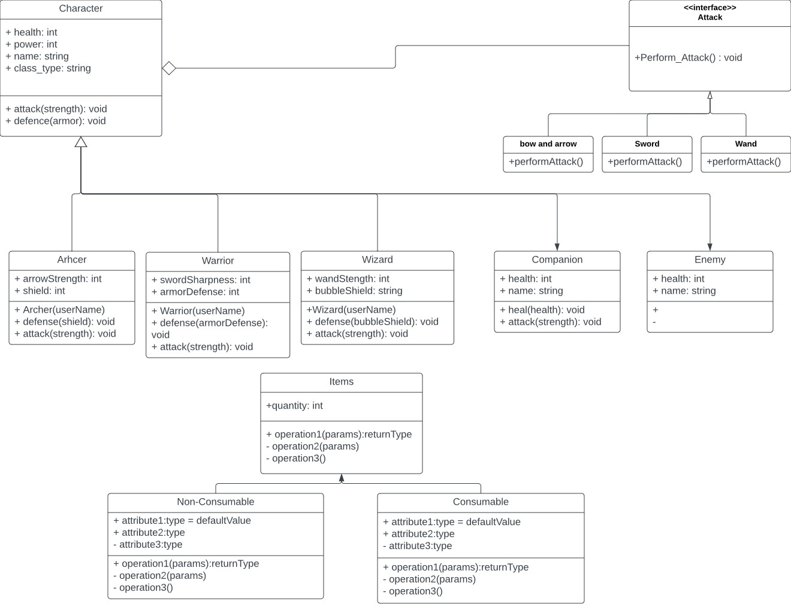

# Text-based RPG Game
 > Authors: [Aszet07](https://github.com/aszet07) [jSwAggy01](https://github.com/jSwAggy01) [CaptainPig-gy](https://github.com/CaptainPig-gy)

## Phase I
 Problem definition: How to make a game that can be experienced as an interactive story, tailored towards the player's decisions.

 Description:
 * We decided upon creating a game because the concept of text-based video game sounded like a fun/interesting idea for a project, seeing as how video games are one of the fields software developers may enter.
 * The game will be taking user input from a series of scripted options (via a terminal) and outputting a situation tailored towards that input/decision. This will continue until the player meets his/her doom or successfully chooses the right choices and gets to the ending/final situation of the game.
 * The game will also be programmed in C++
 * As far as data structures, we might be using trees where the root node represents the start of the game, and the other nodes represent decisions/outcomes. Leaves will represent good or bad endings.
 * Likewise, the features to be implemented are: choices presented via text through a terminal, outcomes telling the player whether or not the decision they made was a desirable one, a companion to accompany the player through this role-playing adventure, and immersive gameplay.

## Class Diagram

 
 > ## Phase II
 > You will need to schedule a check-in for the second scrum meeting with the same reader you had your first scrum meeting with (using Calendly). Your entire team must be present. This meeting will occur on week 8 during lab time.
 > * Before the meeting you should perform a sprint plan like you did in Phase I.
 > * You should also update this README file by adding the following:
 >   * What design pattern(s) did you use? For each pattern you must explain in 4-5 sentences:
 >   We used scrum to organize the team
 >     * Why did you pick this pattern? And what feature did you implement with it?
 >    
 >      Scrum is a good way to organize and pace a project. We used sprint meetings and sprint cycles to share and work on ideas.
 >      Epics and user stories helped to break down the big task of making a game to actionable tasks.
 >      We also made a UML diagram to break down the objects and interactions.
 >     * How did the design pattern help you write better code?
 >     
 >     Sprint meetings gave us time to get together and discuss issues and solutions to problems. 
 >     Tasks that we made from the epics and user stories were manageable for the short timeframe that we have. 
 >     Our UML chart was a good skeleton to show how objects and functions would interact before we started writing. 
 >     The Kanban informed the group on what tasks were in progress and what had to be done, it helped to show the progress we were making during the sprint cycle.
 >     
 >   * An updated class diagram that reflects the design pattern(s) you used. You may combine multiple design patterns into one diagram if you'd like, but it needs to be clear which portion of the diagram represents which design pattern (either in the diagram or in the description).
 >   
 >   Uploaded to main branch
 >   * Make sure your README file (and Project board) are up-to-date reflecting the current status of your project. Previous versions of the README file should still be visible through your commit history.
> 
> During the meeting with your reader you will discuss: 
 > * How effective your last sprint was (each member should talk about what they did)
 > * Any tasks that did not get completed last sprint, and how you took them into consideration for this sprint
 > * Any bugs you've identified and created issues for during the sprint. Do you plan on fixing them in the next sprint or are they lower priority?
 > * What tasks you are planning for this next sprint.

 
 > ## Final deliverable
 > All group members will give a demo to the TA/reader during lab time. The TA/reader will check the demo and the project GitHub repository and ask a few questions to all the team members. 
 > Before the demo, you should do the following:
 > * Complete the sections below (i.e. Screenshots, Installation/Usage, Testing)
 > * Plan one more sprint (that you will not necessarily complete before the end of the quarter). Your In-progress and In-testing columns should be empty (you are not doing more work currently) but your TODO column should have a full sprint plan in it as you have done before. This should include any known bugs (there should be some) or new features you would like to add. These should appear as issues/cards on your Project board.
 > * Make sure your README file and Project board are up-to-date reflecting the current status of your project (e.g. any changes that you have made during the project such as changes to your class diagram). Previous versions should still be visible through your commit history. 
 
 ## Screenshots
 > Screenshots of the input/output after running your application
   # Final Project Output
 > 
 
 ## Installation/Usage!
 * Requirements: 
  * Install and enable the following:
     - C/C++ by Microsoft C/C++ Extension Pack by Microsoft C/C++ 
     - Themes by Microsoft CMake Tools by Microsoft 
     - YAML by Red Hat 
     - Better C++ Syntax by Jeff Hykin 
     - (AND make sure you are running the redhat compiler kit in your IDE)
 * The way to install this game is to download the files from the repository via .zip and in an IDE, run the commands:
   - cmake .
   - make
   - Note: For certain cases, you may need to delete the CMake cache file in order for Make to run correctly (only if you get an error)
 * From there, you can open up any terminal that your computer has, and change directories so that you're in that downloaded folder. Run ./bin/finalProject and the game will be executed :)
 ## Testing
 * For starters, we implemented code coverage software from lab 6 and modified it so that it could analyze how much lines of code our unit tests were covering in the class files
 * The Final Project was tested an validated with google test.
 * Each function of the test helped validate the code for each of the Character Classes.
 * Google Testing was an important step in the final project as it tested the "combat and defense" 
   system of the game before any story or combat was implemented.
 * These tests insured that the code will work when the final deliverable of the game was implemented.
 * In the scope for this final project, team members only needed to implement the working 
   code and no errors were given as it was already tested.
